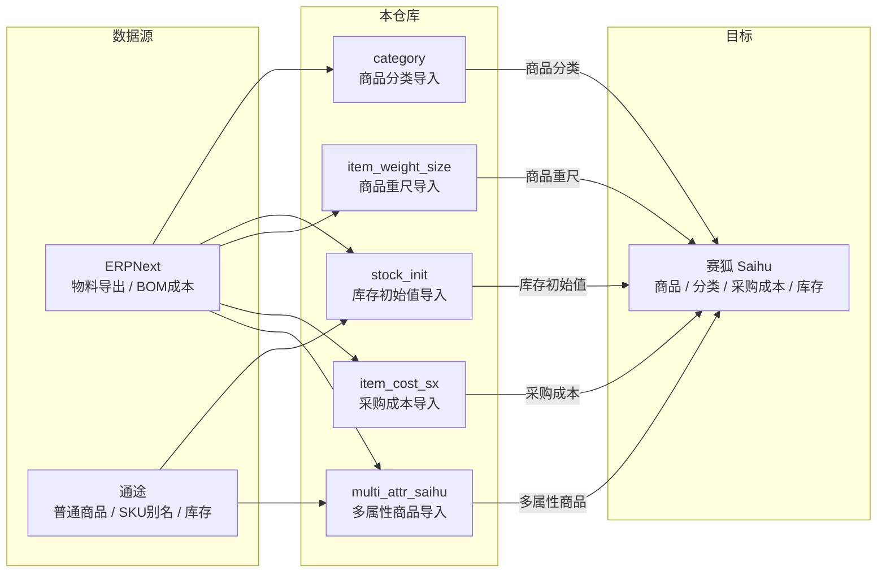

# FZH Data Tools

FZH 公司数据管道工具集。当前主要用于维护**赛狐（Saihu）** / ERPNext / **通途（Tongtu）** 三方数据的一致性和准确性，未来可能扩展其他数据处理场景。

## 系统架构



## 目录结构

```
.
├── pyproject.toml              # uv 环境管理（Python ≥ 3.10）
├── uv.lock                     # 依赖锁定
├── CLAUDE.md                   # AI Agent 项目上下文
├── multi_attr_saihu/           # 多属性商品导入
│   ├── erpnext_to_saihu.py     #   ERP 纵向物料 → 赛狐多属性
│   ├── erp_tongtu_bridge.py    #   通途 SKU 配对
│   ├── tongtu_sku_explode.py   #   通途别名炸开
│   ├── README.md               #   给人看的说明
│   └── AGENT_HANDOFF.md        #   给 Agent 的上下文
├── category/                   # 商品分类导入
│   ├── build_saihu_category_import.py
│   ├── README.md
│   └── AGENT_HANDOFF.md
├── item_cost_sx/               # 采购成本导入
│   ├── bom_cost_to_saihu_item_cost.py
│   ├── README.md
│   └── AGENT_HANDOFF.md
├── item_weight_size/           # 商品重尺导入
│   ├── build_saihu_weight_import.py
│   ├── README.md
│   └── AGENT_HANDOFF.md
└── stock_init/                 # 库存初始值导入
    ├── build_saihu_stock_init.py
    ├── README.md
    └── AGENT_HANDOFF.md
```

## 模块概览

| 模块 | 功能 | 主要输入 | 主要输出 |
|------|------|----------|----------|
| `multi_attr_saihu` | 多属性商品导入 + 通途配对 | ERP 物料导出、通途商品、物料属性 | 赛狐商品导入（按在售/库存拆分） |
| `category` | 商品 4 级分类生成 | 商品导出、物料属性、分类导出 | 赛狐分类导入 + 校验报告 |
| `item_cost_sx` | EN BOM 成本转采购成本 | BOM 成本列表、商品导出 | 赛狐采购成本导入 + 对账报告 |
| `item_weight_size` | 国外发货重尺导入 | 重量模板（手工填写）、商品导出 | 赛狐重尺导入 + 问题报告 |
| `stock_init` | 库存初始值（数量+成本）导入 | 通途库存、BOM 成本、商品导出 | 赛狐库存初始值导入 + 差异报告 |
| `warehouse_restock` | 海外仓备货单导入（三成本拆分） | EN BOM 成本列表、通途库存、商品导出 | 赛狐海外仓备货单导入 + 问题报告 |
| `other_outbound` | 库存清零其他出库导入 | 赛狐库存明细导出 | 赛狐其他出库导入（按仓拆分） |
| `EN_API` | ERPNext 物料组主图上传 | 赛狐图片链接 Excel | ERPNext File + Item Group image 更新 |

八个业务模块**相互独立**（`category` 仅动态导入 `multi_attr_saihu` 的 `_default_spu_from_sku` 函数）。

## 快速开始

### 1. 环境初始化

```bash
# 克隆仓库
git clone git@github.com:keyapi/fzh-data.git
cd fzh-data

# 安装依赖（只需一次，Python ≥ 3.10）
uv sync
```

### 2. 准备数据文件

每个模块需要从对应系统导出数据 XLSX，放入各自的 `数据源/` 子目录。脚本运行时会**自动选取同名的最新文件**（按修改时间），无需手动指定文件名。

| 模块 | 需要放入 `数据源/` 的文件 | 导出系统 |
|------|--------------------------|----------|
| `multi_attr_saihu` | 物料属性表、ERP 物料导出、赛狐模板、通途商品导出 | ERPNext / 通途 / 赛狐 |
| `category` | 赛狐分类导出、赛狐商品导出、分类导入模板 | 赛狐 |
| `item_cost_sx` | EN BOM 成本列表、赛狐商品导出 | ERPNext / 赛狐 |
| `item_weight_size` | 重量模板（手工维护）、赛狐商品导出 | 手工 / 赛狐 |
| `stock_init` | 通途库存结存、EN BOM 成本列表、赛狐商品导出 | 通途 / ERPNext / 赛狐 |

> 具体每个数据文件的列名要求见各模块的 `README.md`。
>
> **生成样例参考文件**：将真实数据文件放入各模块 `数据源/` 后，运行 `uv run python scripts/gen_data_samples.py`，自动生成 `数据源样例/` 下的脱敏参考文件（全部列 + 前 3 行假数据）。列结构变动后需重新运行。

### 3. 运行脚本

```bash
cd multi_attr_saihu
python erpnext_to_saihu.py

cd ../category
python build_saihu_category_import.py

cd ../item_cost_sx
python bom_cost_to_saihu_item_cost.py

cd ../item_weight_size
python build_saihu_weight_import.py

cd ../stock_init
python build_saihu_stock_init.py
```

输出文件在各模块的 `out/` 目录，文件名带时间戳（`*_YYYYMMDD_HHMMSS.xlsx`）。

---

## Agent 环境注意事项（Codex Desktop + Codex++）

如果你用的是 **Codex Desktop + Codex++（自定义模型如 DeepSeek）**：

> 保持左下角审批模式为"默认权限"（默认值）。如果误切到"自动审批"，网页搜索、浏览器控制等功能全部失效。
>
> 详见 [docs/codex_web_search_setup.md](docs/codex_web_search_setup.md)

## 用 Claude Desktop 操作（推荐）

非技术同事无需记住命令。安装 [Claude Desktop](https://claude.ai/download) 后，**用 "Open Folder" 打开本仓库**，然后用自然语言说出需求即可。

### 触发词速查

| 你想做什么 | 就说这句话 |
|-----------|-----------|
| 生成库存初始值导入 | "**库存初始值导入**" 或 "**stock init**" |
| 生成采购成本导入 | "**采购成本导入**" 或 "**BOM 成本**" |
| 生成商品重尺导入 | "**重尺导入**" 或 "**重量尺寸**" |
| 生成分类导入 | "**商品分类导入**" 或 "**四级分类**" |
| 生成多属性商品导入 | "**多属性导入**" 或 "**通途配对**" |

### 工作原理

- 根目录的 [`CLAUDE.md`](CLAUDE.md) 包含项目全局上下文（公司背景、技术栈、踩坑记录），Claude 启动时自动加载
- `.claude/skills/` 下每个模块有独立的 `SKILL.md`，Claude 自动根据你说话的内容匹配对应 Skill
- 你不需要了解技术细节，Claude 会自己找正确的脚本、数据文件、参数

## CLAUDE.md — AI Agent 上下文

根目录的 [`CLAUDE.md`](CLAUDE.md) 是本项目的 **Agent 配置文件**，包含：
- **Andrej Karpathy 通用编码守则** — 所有 AI 修改代码时的行为准则
- **公司背景** — 供应链架构、赛狐仓库映射
- **项目技术栈与约定** — 模块结构、代码风格、Git 流程
- **28 条经验教训** — 涵盖各模块的踩坑记录和赛狐平台规则

在 Claude Code 或 Claude Desktop 打开此项目时，`CLAUDE.md` 会被自动加载为 Agent 的系统提示。**所有文档修改请同步更新 CLAUDE.md**，避免 Agent 使用过时信息。

## 维护约定

| 约定 | 说明 |
|------|------|
| **Git 提交** | 中文消息，格式：`type(scope): 说明` |
| **主分支** | `main`（已从 `master` 迁移） |
| **环境管理** | `uv sync` 安装依赖，Python ≥ 3.10 |
| **文档同步** | 修改脚本行为时，同步更新对应模块的 `README.md` 和 `AGENT_HANDOFF.md`，以及根目录 `CLAUDE.md` |
| **代码为准** | 若文档与代码不一致，以 `.py` 为准 |
