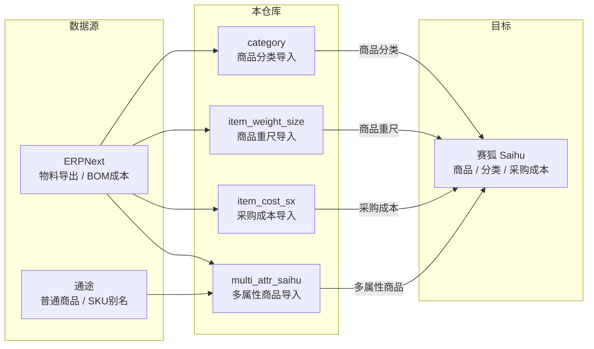

# 赛狐数据管道

维护赛狐（Saihu）/ ERPNext / 通途（Tongtu）三方数据准确性和一致性的 Python 工具集。

## 系统架构



## 目录结构

```
.
├── pyproject.toml              # uv 环境管理
├── multi_attr_saihu/           # 多属性商品导入
│   ├── erpnext_to_saihu.py     #   ERP 纵向物料 → 赛狐多属性
│   ├── erp_tongtu_bridge.py    #   通途 SKU 配对
│   ├── tongtu_sku_explode.py   #   通途别名炸开
│   ├── README.md               #   给人看的说明
│   └── AGENT_HANDOFF.md        #   给 Agent 的上下文
├── category/                   # 商品分类导入
│   ├── build_saihu_category_import.py
│   ├── README.md
│   └── AGENT_HANDOFF.md
└── item_cost_sx/               # 采购成本导入
    ├── bom_cost_to_saihu_item_cost.py
    ├── README.md
    └── AGENT_HANDOFF.md
└── item_weight_size/           # 商品重尺导入
    ├── build_saihu_weight_import.py
    ├── README.md
    └── AGENT_HANDOFF.md
```

## 模块概览

| 模块 | 功能 | 主要输入 | 主要输出 |
|------|------|----------|----------|
| `multi_attr_saihu` | 多属性商品导入 + 通途配对 | ERP 物料导出、通途商品、物料属性 | 赛狐商品导入（按在售/库存拆分） |
| `category` | 商品 4 级分类生成 | 商品导出、物料属性、分类导出 | 赛狐分类导入 + 校验报告 |
| `item_cost_sx` | EN BOM 成本转采购成本 | BOM 成本列表、商品导出 | 赛狐采购成本导入 + 对账报告 |
| `item_weight_size` | 国外发货重尺导入 | 重量模板（手工填写）、商品导出 | 赛狐重尺导入 + 问题报告 |

四个模块**相互独立**，无代码依赖（`category` 仅动态导入 `multi_attr_saihu` 的 `_default_spu_from_sku` 函数）。

## 快速开始

```bash
# 安装依赖（仓库根目录）
uv sync

# 各模块在自身目录下运行
cd multi_attr_saihu
python erpnext_to_saihu.py [物料导出.xlsx] [模板.xlsx] --spu-status "EN物料属性.xlsx"

cd ../category
python build_saihu_category_import.py

cd ../item_cost_sx
python bom_cost_to_saihu_item_cost.py

cd ../item_weight_size
python build_saihu_weight_import.py
```

## 数据目录约定

数据文件（`.xlsx`）**不纳入 Git**（`.gitignore` 已忽略）。约定目录如下：

| 目录 | 用途 |
|------|------|
| `multi_attr_saihu/` | 物料属性表、ERP 导出、赛狐模板、通途源文件、脚本输出 |
| `edit_item/` | 赛狐商品导出（`商品导出 *.xlsx`）、部分输出结果 |
| `en_bom_cost_list/` | ERPNext BOM 成本列表导出 |
| `category/` | 赛狐分类导出、分类导入模板、输出结果 |
| `item_cost_sx/out/` | 采购成本导入结果、问题报告 |
| `item_weight_size/` | 重量模板（手工填写）、赛狐商品导出、赛狐重尺导入模板 |

## 维护约定

| 约定 | 说明 |
|------|------|
| **Git 提交** | 中文消息，格式：`type(scope): 说明` |
| **环境管理** | `uv sync` 安装依赖，Python ≥ 3.10 |
| **文档同步** | 修改脚本行为时，同步更新对应模块的 README.md 和 AGENT_HANDOFF.md |
| **代码为准** | 若文档与代码不一致，以 `.py` 为准 |
