# Codex Desktop + Codex++ 安装配置指南

> 最后更新：2026-06-29
> 面向：公司内部非技术同事（运营、供应链、财务等）
> 目标：装好 AI Agent，用上公司内部 API 中转

---

## 概述

你只需要装两个东西：

| 软件 | 作用 | 免费？ |
|------|------|:---:|
| **Codex Desktop** | AI 助手本体（聊天、写文档、处理 Excel） | ✅ 免费下载 |
| **Codex++** | 增强工具，让 Codex 能接公司内部 API | ✅ 开源免费 |

然后用钉钉登录公司 API 后台获取一个"令牌"，填到 Codex++ 里就能用了。

---

## 第一步：安装 Codex Desktop

### Windows 11（推荐）

1. 打开 **Microsoft Store**（开始菜单搜索 "Store"）
2. 搜索 **"Codex"**，认准发布者 **OpenAI**
3. 点击 **"获取"** 或 **"安装"**
4. 安装完成后点 **"打开"**，或从开始菜单启动

> **如果搜不到 Codex**：打开 Windows 设置 → 时间和语言 → 地区 → 改为 **美国**，然后重试。

直达链接：https://apps.microsoft.com/detail/9plm9xgg6vks

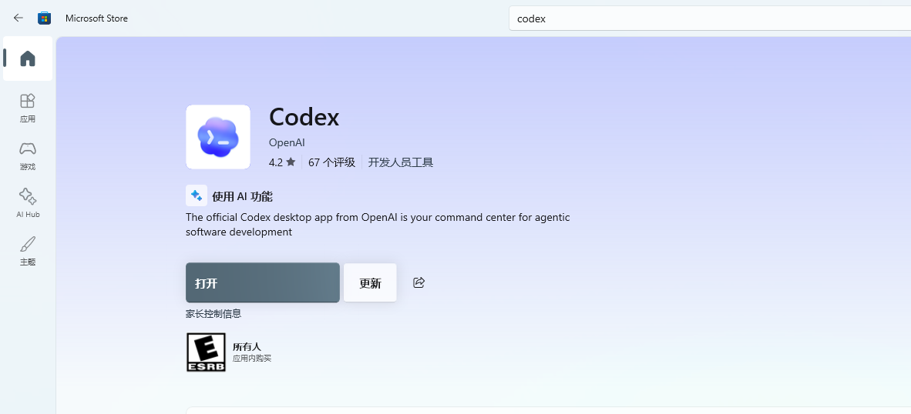

### 备用：winget 命令行安装

右键开始菜单 → **终端（管理员）**，粘贴以下命令：

```powershell
winget install Codex -s msstore --accept-source-agreements --accept-package-agreements
```

### macOS

1. 打开 https://developers.openai.com/codex/app
2. 下载 **macOS 版 DMG** 文件
3. 双击 DMG，把 Codex 拖到 Applications 文件夹
4. 首次打开如果提示"无法验证开发者"：**系统设置 → 隐私与安全性 → 仍要打开**

### 注意

安装完 Codex Desktop 后**先不要启动**，直接去装 Codex++。不需要注册 ChatGPT 账号——后面通过 Codex++ 直接连公司 API。

---

## 第二步：安装 Codex++

Codex++ 是 GitHub 上的开源项目，给 Codex 增加"切换 API 供应商"功能。

### 下载

打开：https://github.com/BigPizzaV3/CodexPlusPlus/releases

选择最新版本，根据你的系统下载：

| 系统 | 文件名 |
|------|--------|
| Windows | `CodexPlusPlus-*-windows-x64-setup.exe` |
| Mac Intel | `CodexPlusPlus-*-macos-x64.dmg` |
| Mac Apple Silicon | `CodexPlusPlus-*-macos-arm64.dmg` |

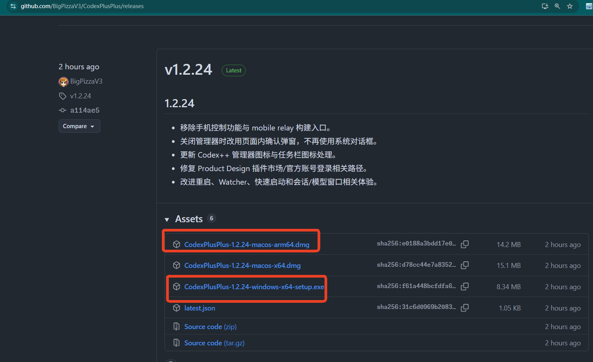

### 安装

- **Windows**：双击 exe，按向导完成。建议装到非系统盘（如 `D:\Programs`）
- **macOS**：双击 DMG → 拖入 Applications

安装完成后，开始菜单（或 Launchpad）会出现两个新图标：

| 图标 | 用途 |
|------|------|
| **Codex++** | 🟢 **日常启动用这个** |
| **Codex++ 管理工具** | 🔧 配置 API 供应商 |

> ⚠️ 以后每次启动 AI 助手都点 **Codex++**，不要直接点原版 Codex，否则连不上公司 API。

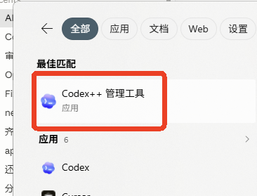

---

## 第三步：获取 API 令牌

公司已经部署了 AI API 中转服务，用钉钉扫码就能登录领取令牌。

### 3.1 打开后台

浏览器打开：**https://api.vilavi.cn/**

用 **钉钉扫码** 登录。

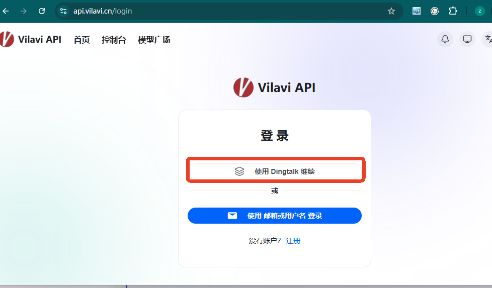

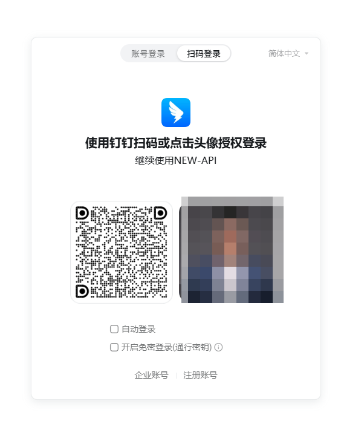

### 3.2 找到你的令牌

登录后进入 new-api 管理后台：

1. 左侧菜单 → **令牌管理**
2. 如果已经有令牌，直接点 **复制** 拿到 `sk-` 开头的 key
3. 如果没有令牌，点 **新建令牌** → 名称随意填 → 提交 → 复制生成的 key

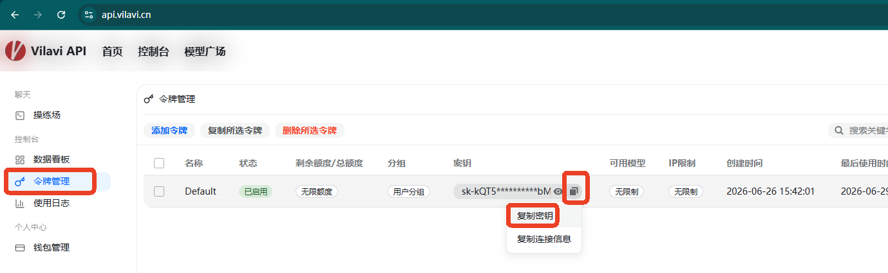

> ⚠️ 首次登录后可能需要等 **最多 1 分钟**，系统才会自动创建令牌并分配额度。如果令牌列表为空，喝口水再刷新。

### 3.3 保管好令牌

- 令牌是一串 `sk-xxxxxxxx` 开头的字符
- **不要发给别人**，不要贴到群里
- 额度用完了找管理员申请

---

## 第四步：配置 Codex++

现在把令牌填到 Codex++ 里。

### 4.1 添加供应商

1. 双击 **"Codex++ 管理工具"** 图标
2. 点击左侧 **"供应商配置"** → 右侧 **"添加供应商"**
3. 填写以下内容：

| 配置项 | 填什么 |
|--------|--------|
| 名称 | `公司个人账号` |
| 接入模式 | 纯 API |
| Base URL | `https://api.vilavi.cn` |
| Key | 粘贴第三步复制的 `sk-` 令牌 |
| 上游协议 | **Chat Completions** |

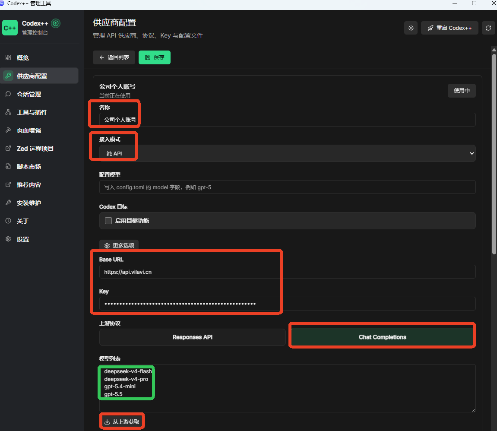

### 4.2 获取模型并保存

1. 填好 Key 之后，点击 **"从上游获取"**，系统会自动拉取可用模型列表——能拉取到模型就表示连接成功
2. 点击 **"保存"**
3. 鼠标移到刚创建的"公司个人账号"条目上，点击 **"使用"**

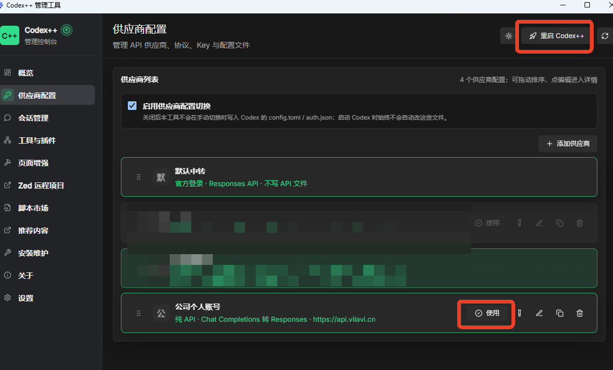

## 第五步：沙箱权限设置

Codex 默认在"沙箱"中运行，限制访问你的文件系统。为了让 AI 能读写文件、访问网络，需要调整权限。

> 2026 年 6 月底版本可能不再自动弹窗询问权限，需要手动设置。

### 5.1 检查设置

打开 Codex Desktop，点击左下角齿轮图标进入 **Settings**：

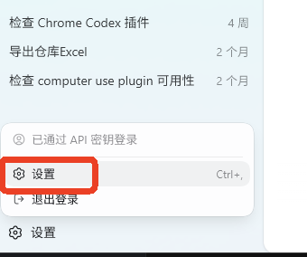

进入 **Agent** 页面：

- **沙盒设置**：设为 `工作区写入`（推荐）或 `完全访问`
- **允许网络访问**：开启

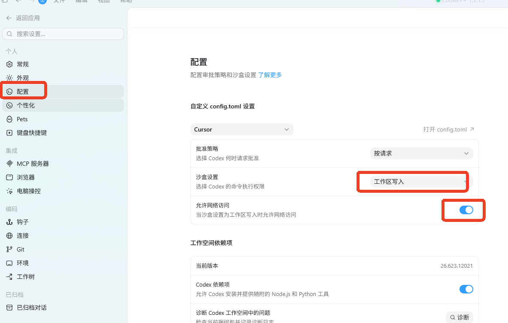

> 改完设置后需要重启 Codex Desktop。注意：除了关闭窗口，Windows 右下角托盘里的 Codex 图标也要**右键退出**，否则配置不生效。

### 5.2 审批模式

Codex 左下角有一个审批模式切换，**保持"默认权限（手动审批）"**。

- ❌ 不要切到"自动审批" → 会导致网页搜索、浏览器控制等功能全部失效
- ✅ "默认权限" → AI 做敏感操作时会弹窗让你确认

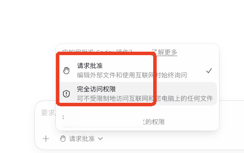

---

## 第六步：日常使用

### 启动方式

**每次都用 Codex++ 图标启动**，不要用原版 Codex。

启动后确认左下角模型列表中出现了你在第四步配置的模型。

### 可以用 AI 做什么

- 📊 "帮我把这个月的销售数据做成 Excel，按品类汇总"
- 🌐 "去这个网页抓取价格数据"
- 📋 "把这份会议纪要转成待办清单"
- 🧹 "合并这三个 CSV 文件，去掉重复行"

### 打开本项目

启动 Codex++ 后，用 **Open Folder** 打开本仓库目录（如 `D:\fzh-data`），AI 会自动加载项目知识，你直接用中文说需求即可。

---

## 常见问题

### 令牌列表为空

首次通过钉钉登录后，系统需要自动创建令牌和分配额度，**最多等待 1 分钟**，刷新页面即可。

### 测试连通性失败

1. 检查 Base URL 是否填对：`https://api.vilavi.cn`（最后不要加 `/`）
2. 检查 Key 是否完整复制（以 `sk-` 开头）
3. 检查上游协议是否选了 **Chat Completions**
4. 确认电脑能正常上网

### 如何更新

- **Codex Desktop**：Microsoft Store 自动更新，或用 `winget upgrade Codex`
- **Codex++**：管理工具 → 检查更新，或去 GitHub Releases 下载最新版

---

## 截图命名规范

> 给补充截图的同事看的。按这个规则来，截图放进对应位置就行。

### 文件命名规则

- 全部小写，单词之间用 `-` 连接
- 按 `步骤序号-简短描述.png` 格式命名
- 不要用空格、中文、下划线

### 截图清单

所有截图放在 `docs/images/` 目录下，对照下表：

| 文件名 | 截图内容 | 对应步骤 |
|--------|---------|---------|
| `step1b-store-search.png` | Microsoft Store 搜索 Codex | 第一步 — Windows |
| `step2a-github-releases.png` | Codex++ GitHub Releases 页面 | 第二步 — 下载 |
| `step2b-start-menu-icons.png` | 开始菜单中 Codex++ / 管理工具两个图标 | 第二步 — 安装 |
| `step3a-vilavi-login.png` | api.vilavi.cn 钉钉扫码登录页 | 第三步 — 登录后台 |
| `step3a2-dingtalk-qrcode.png` | 钉钉扫码弹窗 | 第三步 — 登录后台 |
| `step3b-token-management.png` | new-api 令牌管理页面（圈复制按钮） | 第三步 — 找令牌 |
| `step4b-provider-form.png` | 供应商配置表单（名称填"公司个人账号"） | 第四步 — 添加供应商 |
| `step4c-save-success.png` | 供应商已保存并启用 | 第四步 — 保存 |
| `step5a-settings-button.png` | 左下角齿轮设置入口 | 第五步 — 沙箱 |
| `step5b-sandbox-settings.png` | Settings → Agent 沙箱设置页 | 第五步 — 沙箱 |
| `step5c-approval-mode.png` | 左下角审批模式（默认权限） | 第五步 — 审批 |

### 怎么截图

1. 用钉钉截图快捷键：`Ctrl+Shift+A`
2. 框选需要的区域后，钉钉截图工具栏点 **保存**（💾 图标）
3. 保存到 `docs/images/` 目录，文件名严格对照上表
4. 截图格式用 **PNG**，不要用 JPG（JPG 会让文字变模糊）

### 截图建议

- 截取时尽量只框选**有效区域**，去掉任务栏、桌面背景等无关内容
- 如果是弹窗、菜单等小界面，用钉钉截图后裁剪到刚好包住窗口边缘
- 如果需要圈出点击位置，用钉钉截图工具栏的 **矩形/箭头** 标注
- 每张图控制在 500KB 以内；如果太大，用 `Ctrl+Shift+A` 截完保存时选择"小文件"
- 涉及令牌、密码等敏感信息的部分**打码**（钉钉截图工具栏 → 马赛克）

### Markdown 引用格式

文档中已按如下格式写好了引用，截图放进去后自动显示：

```markdown

```

---

## 相关文档

- [AI Agent 桌面端对比](./ai-agent-desktop-comparison.md) — 为什么选 Codex 而不是 Claude Desktop
- [Codex 网络搜索踩坑记录](./codex_web_search_setup.md) — 审批模式为什么不能切到自动
- [快速上手（Claude Desktop）](./onboarding.md) — 如果你用的是 Claude Desktop 而非 Codex
