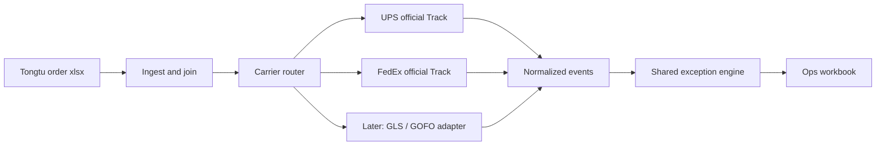
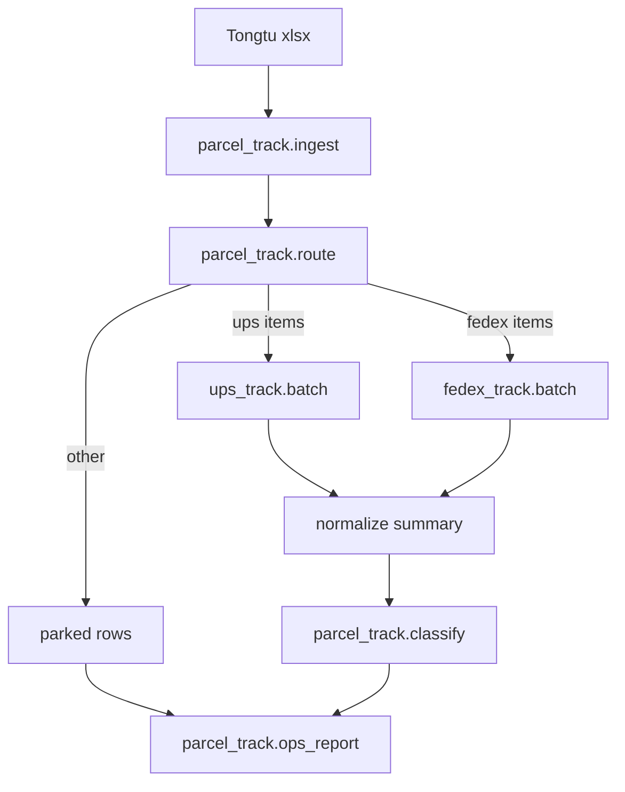

# Multi-Carrier Parcel Track - Plan

## Goal Capsule

- **Objective:** From one Tongtu non-FBA order file, detect UPS vs FedEx (and later other last-mile carriers), batch-query official tracking, and produce one ops exception workbook using the same 迟发 / 承运延误 / 卡件 vocabulary FedEx already uses.
- **Product authority:** Amazon FBM ops using Tongtu exports; FedEx `ops_report` runbook is the classification source of truth for v1.
- **Open blockers:** None. GLS credentials and GOFO tracking source stay out of v1.
- **Product Contract preservation:** unchanged.
- **Execution:** `code`. Test-first for router and classify; mock HTTP for orchestration.

## Product Contract

### Summary

Build a thin orchestration in front of the existing UPS and FedEx official Track clients: ingest a Tongtu order workbook, route rows by carrier, query each carrier, then classify exceptions in one shared engine.
v1 must ship the shared exception report for UPS as well as FedEx, not a dispatcher that only concatenates today's two CLIs.
Do not install Karrio, AfterShip, or 17TRACK as the primary tracking runtime.

### Problem Frame

`ups_track` already batch-queries official UPS Track and writes summary plus timeline.
`fedex_track` copied that skeleton and added the ops Excel that ops actually uses (迟发 vs 承运延误 vs 卡件, Amazon business days).
Today a mixed Tongtu file has to be split by hand, run twice, and only FedEx gets the exception workbook.
GLS and GOFO will appear later, but GLS has no account yet and GOFO has no public self-serve Track API; waiting for a grand platform would freeze the UPS/FedEx pain that already exists.

### Key Decisions

- **Thin orchestration, keep official per-carrier clients.** `(session-settled: user-approved — chosen over Karrio/AfterShip/17TRACK as the primary runtime: those solve HTTP adapters, not Amazon-calendar exception labels; sellfox_shipping already rejected embedding Karrio until ~5 carriers.)`
- **v1 includes the shared exception report, including UPS.** `(session-settled: user-directed — chosen over a first slice that only routes to existing CLIs: ops value is the 迟发/延误 workbook, not a second way to dump timelines.)`
- **Detect carrier from Tongtu columns first, tracking-number shape second.** Channel / 物流方式 / 物流商 text is more reliable than regex (FedEx 12-digit collides; GOFO `GFUS…` is distinctive; UPS `1Z` is reliable).
- **Shared classification vocabulary; per-carrier thresholds.** 漏发/未交接、迟发、承运延误、卡件、取消、数据异常 stay one set of labels. Handling and transit day cutoffs may differ by carrier; FedEx keeps current runbook defaults until ops recalibrates UPS.
- **Aggregator APIs are a last-resort adapter, not the hub.** Use AfterShip / 17TRACK / VITE `/track` only when a carrier has no official Track API we can call (likely GOFO). Official UPS/FedEx stay official.

### Actors

- A1. Amazon FBM ops: drops a Tongtu export, wants one Excel of 漏发/迟发/延误/卡件 to action.
- A2. Agent / developer: runs the orchestration locally with existing UPS/FedEx `.env` credentials; does not scrape carrier websites.

### Key Flows

- F1. Mixed Tongtu file to one ops workbook
  - **Trigger:** Ops (or agent) has a Tongtu non-FBA order xlsx with tracking numbers and carrier-ish columns.
  - **Actors:** A1, A2
  - **Steps:** Ingest rows; assign each row a carrier; skip or park unknown carriers with a reason; query UPS and FedEx with existing official clients (resume/limit/delay unchanged in spirit); join tracking events back to Tongtu identity (order / package / account); classify; write one multi-sheet workbook.
  - **Outcome:** One file covering both carriers; unroutable rows remain in a parked sheet, not dropped.
  - **Covered by:** R1, R2, R3, R4, R7

- F2. UPS-only or FedEx-only slice
  - **Trigger:** File contains only one of the v1 carriers, or the user filters to one carrier.
  - **Steps:** Same pipeline; unused adapter is not called.
  - **Covered by:** R1, R5

### Requirements

**Ingest and routing**

- R1. The operator can feed one Tongtu non-FBA order workbook and get tracking plus exception classification for every row whose carrier is UPS or FedEx.
- R2. Carrier assignment prefers Tongtu carrier/channel columns; tracking-number pattern is only a fallback when the column is empty or ambiguous.
- R3. Rows that cannot be assigned UPS or FedEx are kept with a skip reason (unknown carrier, missing tracking number, unsupported carrier such as GLS/GOFO in v1). Quantity in equals quantity out plus an accountable parked set.

**Query**

- R4. UPS and FedEx queries use the existing official Track clients (OAuth, batching, resume, token-invalid retry). The orchestration does not re-implement those HTTP contracts.
- R5. Per-carrier query still produces the current three-file audit trail (summary, timeline, raw) so a single-carrier rerun remains possible.

**Exception classification**

- R6. One shared engine classifies 漏发/未交接、迟发、承运延误、卡件、取消、数据异常 using Amazon business days (weekends and US federal holidays excluded), matching the FedEx ops runbook: 迟发 is late handover (label → first pickup scan minus handling days); 承运延误 is slow transit (pickup → delivered); 卡件 is undelivered with last scan older than the stuck threshold; when both 迟发 and 承运延误 apply, 承运延误 wins as the primary label.
- R7. UPS rows go through that same engine in v1. FedEx thresholds stay the current runbook defaults. UPS may use the same calendar with its own transit/stuck constants if ops has not calibrated yet; the workbook must show which constants were applied.
- R8. Identity join strips FedEx multi-ticket suffixes such as `[n]` before matching Tongtu tracking numbers.

**Non-goals encoded as requirements**

- R9. v1 does not call GLS or GOFO tracking APIs and does not require GLS/GOFO credentials.
- R10. v1 does not buy labels, rate-shop, or write tracking back to Sellfox. `sellfox_shipping` remains the label-purchase system.

### Acceptance Examples

- AE1. Mixed file, both carriers healthy
  - **Covers:** R1, R4, R6, R7
  - **Given:** A Tongtu export with some UPS `1Z…` rows and some FedEx rows, both queryable.
  - **When:** The orchestration runs to completion.
  - **Then:** Both sets appear in one workbook; UPS 迟发 uses label→pickup business days; a delivered-but-late-handover UPS row is 迟发; a late-handover plus slow-transit row is 承运延误.

- AE2. Unknown or future carrier parked
  - **Covers:** R3, R9
  - **Given:** The same file also contains GLS or GOFO tracking numbers, or a blank 物流商 with an unrecognised number.
  - **When:** The run finishes.
  - **Then:** Those rows are in the parked/skip sheet with a reason; they are not silently omitted from the in/out count; UPS/FedEx rows still classify.

- AE3. Column beats regex
  - **Covers:** R2
  - **Given:** A row whose tracking number could be mistaken for FedEx, but the Tongtu carrier column says UPS.
  - **When:** Routing runs.
  - **Then:** The row is queried as UPS.

### Success Criteria

- Ops can stop splitting Tongtu files by carrier to get UPS exception labels comparable to today's FedEx workbook.
- A planner reading this can implement without inventing classification rules: copy FedEx runbook semantics, then parameterize thresholds.
- Unmatched and unsupported carriers remain countable in the run report (入 N / 出 M / 停放 K).

### Scope Boundaries

**Deferred for later**

- GLS Europe Track (official ShipIT / public Track&Trace exists; blocked on account from GLS contact).
- GOFO tracking adapter (no public self-serve Track API; candidates are VITE `POST /track`, AfterShip, 17TRACK; labels are already bought via VITE in `sellfox_shipping`).
- Dual flags `是否迟发` / `是否延误` on every row (FedEx review already allowed this as a follow-up).
- Monthly unattended job / DingTalk push.
- Real handling-day calibration from warehouse clocks.

**Outside this product's identity**

- Multi-carrier SaaS as the system of record (AfterShip branded tracking pages, 17TRACK consumer UI).
- Embedding Karrio Server or Odoo/ERPNext shipping apps.
- Scraping FedEx/UPS/GOFO public track pages.
- Merging this work into `sellfox_shipping` label purchase.

### Dependencies / Assumptions

- UPS and FedEx Track production credentials already work on this machine (as used by `ups_track` and `fedex_track`).
- Tongtu exports used for FedEx ops_report are the same shape ops will feed for mixed files.
- Amazon business-day calendar is the v1 clock even when some Tongtu rows are non-Amazon; `Amazon是否判迟` is only meaningful for Amazon channels.
- VITE `/track` may cover some GOFO numbers later; that is unverified and not v1.

### Outstanding Questions

**Resolved in planning**

- Tongtu columns: reuse `fedex_track.ops_report.TT_PICK` (`邮寄方式`, `跟踪号` substring, identity fields). Router also reads `邮寄方式` / `渠道`.
- UPS transit/stuck: same numeric defaults as FedEx, labeled uncalibrated in 口径说明; display name is 承运延误 not FedEx延误.
- Extract `_cat` / `bizdays` / CLASS into `parcel_track/classify.py`; `fedex_track.ops_report` becomes a thin wrapper.

### Sources / Research

- Existing modules: `ups_track/` (batch query only), `fedex_track/` (batch query + `ops_report.py` + `fedex_track/docs/ops-report-runbook.md`).
- Prior reuse verdict: `sellfox_shipping/docs/research/open-source-reuse-dossier-2026-08-07.md` — Karrio Reference only; do not embed the server.
- Open-source: [Karrio](https://github.com/karrioapi/karrio) unified track API (UPS/FedEx production-ready, GLS development); [tracking-numbers](https://pypi.org/project/tracking-numbers/) / [drogher](https://github.com/jbittel/drogher) for regex detection only.
- SaaS aggregators: AfterShip (courier detect + 1400 carriers, per-shipment billing), 17TRACK (broad including GOFO), EasyPost Trackers (fits if you already buy labels there; we do not).
- GLS: ShipIT REST `/parceldetails` and `api.gls-group.eu/public/v1` Track&Trace; credentials from local GLS contact.
- GOFO: public site track/login; AfterShip/17TRACK/TrackingMore claim coverage; company already creates GOFO labels via VITE `POST /shipment2/gofo` (`vite-api` docs). VITE also documents `POST /track` as multi-carrier — probe later, not v1.

---

## Planning Contract

### Key Technical Decisions

- KTD1. **New `parcel_track/` orchestration module, keep `ups_track` and `fedex_track` as HTTP clients.** `(session-settled: user-approved — chosen over Karrio/AfterShip as runtime: adapters already exist and ops classification is the shared core.)`
- KTD2. **v1 ships shared classify + mixed workbook, not a CLI-only dispatcher.** `(session-settled: user-directed — chosen over router-only first slice.)`
- KTD3. **Extract classify from `fedex_track/ops_report.py` into `parcel_track/classify.py`.** `_cat`, `bizdays`, thresholds, CLASS stay one implementation. Rename display `FedEx延误` → `承运延误` (EN key `carrier_slow`, keep alias `fedex_slow` in FedEx wrapper tests).
- KTD4. **Detect carrier with `邮寄方式`/`渠道` keywords first, then tracking-number regex.** UPS: `1Z` prefix. FedEx: 12-digit / 15-digit / `96` ground when 邮寄方式 mentions fedex/联邦. Ambiguous → parked `unknown`.
- KTD5. **Orchestrator calls `ups_track.batch.run_batch` and `fedex_track.batch.run_batch` in-process.** Do not shell out. Map UPS `实际发货时间` → classify pickup (`站点收件时间`). Write per-carrier three-file trails plus one merged summary for the workbook.
- KTD6. **`fedex_track.ops_report` remains a working entrypoint** that imports shared classify/workbook so existing FedEx-only runbooks do not break.

### High-Level Technical Design

Unified summary fields for classify: 跟踪号, 承运商, 建标时间, 站点收件时间, 交付时间, 最近节点时间, 已取消, 当前状态, 备注.

### Assumptions

- Local clone may lag `origin/main`; implement against `origin/main` `fedex_track` (already merged PR 213).
- UPS has no 已取消 column; treat missing as not cancelled unless status text says void/cancel.
- `--mock` on the orchestration CLI uses each client's existing mock payloads so tests stay offline.

### Sequencing

U1 ingest+route tests → U2 classify extract + FedEx wrapper → U3 orchestrate CLI → U4 shared workbook → U5 docs/AGENTS/skill/index.

---

## Implementation Units

### U1. Tongtu ingest and carrier router

- **Goal:** Split a Tongtu workbook into UPS / FedEx / parked rows with skip reasons. Covers R1–R3, AE2, AE3.
- **Files:** `parcel_track/ingest.py`, `parcel_track/route.py`, `parcel_track/tests/test_route.py`
- **Approach:** Load sheet 0 with pandas/openpyxl. Find 跟踪号 column by substring. Carrier score from `邮寄方式` then `渠道` (keywords ups/联合包裹 vs fedex/联邦快递). Fallback regex: `^1Z` → ups; else fedex-like digits only if 邮寄方式 empty. Preserve all TT_PICK identity fields on the row.
- **Test scenarios:**
  - 邮寄方式 says UPS but number looks numeric → ups (AE3).
  - Empty 邮寄方式 + `1Z…` → ups.
  - GLS/GOFO/blank unknown → parked with reason, count conserved.
- **Verification:** `uv run python -m pytest parcel_track/tests/test_route.py -q`
- **Dependencies:** none

### U2. Shared classify engine

- **Goal:** One `_cat` for UPS and FedEx events. Covers R6–R8, AE1.
- **Files:** `parcel_track/classify.py`, `parcel_track/tests/test_classify.py`, `fedex_track/ops_report.py` (import shared `_cat`/`bizdays`/thresholds), `fedex_track/tests/test_ops_report.py` (adjust FedEx延误 alias if needed)
- **Approach:** Move `_cat`, `bizdays`, `HANDLING_DAYS`, transit/stuck constants, CLASS. Primary slow key `carrier_slow` with Chinese 承运延误. Delay still wins over late. Strip `[n]` in join helper `_bare_tracking`.
- **Test scenarios:**
  - Delivered, late handover only → late_handover.
  - Late handover and slow transit → carrier_slow.
  - Undelivered, last scan > STUCK_DAYS → stuck.
  - FedEx wrapper still classifies a known fixture the same as today except display string for slow.
- **Verification:** `uv run python -m pytest parcel_track/tests/test_classify.py fedex_track/tests/test_ops_report.py -q`
- **Dependencies:** U1 not required; can parallel. Needs `fedex_track` on the branch (merge/checkout main first).

### U3. Orchestration query CLI

- **Goal:** `python -m parcel_track.cli report --tt <xlsx> --out <xlsx> [--mock]` queries both carriers and writes per-carrier trails. Covers R4, R5, F1, F2.
- **Files:** `parcel_track/orchestrate.py`, `parcel_track/cli.py`, `parcel_track/__init__.py`, `parcel_track/tests/test_orchestrate.py`
- **Approach:** Build `ups_track.batch.BatchItem` / `fedex_track.batch` items from routed rows. `--mock` uses each module's mock query. `--limit` applies per carrier after route. Map UPS 实际发货时间 to 站点收件时间. Write `<out>-ups.summary.csv` and `<out>-fedex.summary.csv` plus merged `<out>.summary.csv`.
- **Test scenarios:**
  - Mixed mock file → both adapters called, merged summary has carrier column.
  - UPS-only file → FedEx adapter not called.
  - Parked rows not sent to either client.
- **Verification:** `uv run python -m pytest parcel_track/tests/test_orchestrate.py -q`
- **Dependencies:** U1

### U4. Shared ops workbook

- **Goal:** One Excel with 承运商 column; parked sheet; 口径 shows per-carrier constants. Covers R6, R7, F1.
- **Files:** `parcel_track/ops_report.py`, `parcel_track/tests/test_ops_report.py`, `fedex_track/ops_report.py` (delegate `build()` to shared when `--tt` used, or keep Excel writer in parcel_track and FedEx CLI calls it)
- **Approach:** Copy FedEx sheet layout; add 承运商; KPI 承运延误 not FedEx延误; new sheet `未支持/停放`. Title 尾程运营异常总览.
- **Test scenarios:**
  - Mixed classified rows land on 迟发 vs 承运异常 sheets by key.
  - Parked GLS row appears on 停放 sheet and in in/out counts.
- **Verification:** `uv run python -m pytest parcel_track/tests/test_ops_report.py -q`
- **Dependencies:** U2, U3

### U5. Docs, skill, index

- **Goal:** Agent-findable module. Covers R9, R10 (stated as non-goals in README).
- **Files:** `parcel_track/README.md`, `parcel_track/AGENT_HANDOFF.md`, `parcel_track/docs/index.md`, `parcel_track/docs/log.md`, `.agents/skills/parcel-track/SKILL.md`, `AGENTS.md`, run `scripts/update_index.py`
- **Approach:** OKF Index+Log. Skill triggers: 通途订单跟踪, UPS/FedEx 混合, 迟发延误. Point GLS/GOFO to deferred.
- **Test scenarios:** none beyond `update_index.py` succeeding.
- **Verification:** `uv run python scripts/update_index.py --check` if supported, else generate.
- **Dependencies:** U4 (can draft earlier)

---

## Verification Contract

- Router/classify/orchestrate/ops: `uv run python -m pytest parcel_track/tests -q`
- FedEx regression: `uv run python -m pytest fedex_track/tests -q`
- UPS regression: `uv run python -m pytest ups_track/tests -q`
- Live Track APIs are optional and not required for done.

## Definition of Done

- Mixed mock Tongtu-like xlsx produces one workbook with UPS 迟发/承运延误 and FedEx rows, plus parked unsupported carriers.
- `fedex_track.ops_report` still runs (shared classify).
- No Karrio/AfterShip dependency in `pyproject.toml`.
- Abandoned experimental files removed from the diff.
- Branch + PR, not direct push to main.

