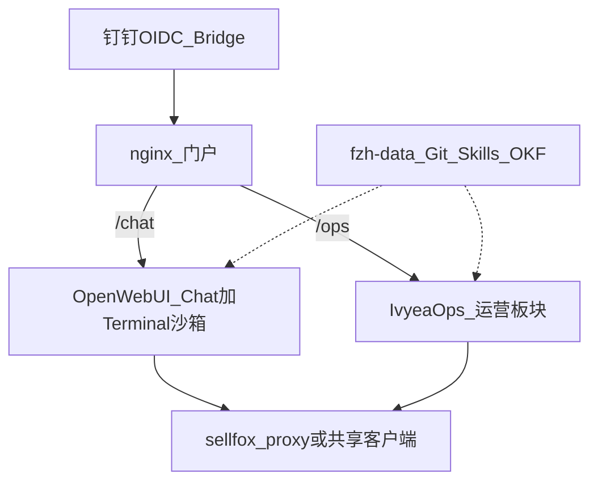

# FZH 统一 AI 接入 — 独立复审与平台裁决

> **读者**: 张克勇 / 后续 Agent  
> **相对原调研**: 不采信单一 Agent 倾向；OIDC/RAG/Stars 降权；「领星写死」改为分层工作量审计  
> **交付范围**: 开放问题 8.1–8.5 证据结论 + 平台裁决（不做 PoC、不联系 Hector/zach）

## 0. 方法与权重

### 证据等级

| 等级 | 含义 |
|------|------|
| L1 | 仓库源码 / 官方文档原句 |
| L2 | issue/PR/可复现讨论 |
| L3 | 二手综述或原调研主张（默认不采信） |
| L4 | 推断（不得单独支撑裁决） |

### 固定评价权重（执行时未改）

1. Level A 可落地（模板/按钮式）— 最高  
2. 有手脚（赛狐 API + 分析执行）  
3. 维护者不绑死在个人（运营可用 Agent 改规则/SOP）  
4. 桌面+Web 知识同源（OKF / SKILL.md / Git）  
5. 4C8G 可部署 + 浏览器可用  
6. OIDC / RAG / 社区规模 — 仅加分  

记分：每维 0–2 分；权重乘数分别为 5 / 4 / 4 / 3 / 2 / 1。

---

## 1. Phase 0 — 事实 vs 原主张对照

| 原主张（PR #109） | 独立核实 | 等级 | 判定 |
|-------------------|----------|------|------|
| Open WebUI 有 Skills，可加载 Markdown | 官方 Skills 文档：Workspace Skills；支持 Import `.md` + YAML `name`/`description`；`$` 提及或绑模型 + `view_skill` | L1 | **部分成立** — 是「导入到平台 DB」，不是挂载 Git 目录自动加载 |
| Open WebUI Tools 可写 Python 调 API | Workspace Tools = 进程内 Python；等同服务器任意代码权限 | L1 | **成立** |
| Open WebUI 可挂载 Git 作知识源 | 原生无「绑仓库目录」；**oikb**（需 OWUI ≥0.9.6）支持 `github:owner/repo` / 本地目录增量同步到 Knowledge Base | L1 | **原主张过简** — 需 companion 工具，非平台内置挂载 |
| IvyeaOps「领星写死」= 改 endpoint 即可 | 传输层 `lingxing_openapi.py` 独立且清晰；但另有 `lingxing_*.py` 服务 8+、前端 `LingXing*.tsx` 11、全链路字段/路由均领星契约；签名算法为 MD5+AES-ECB，与赛狐 HMAC-SHA256 **完全不同** | L1 | **原否决过粗，但「机械换端点」亦低估** |
| IvyeaOps 有电商业务模块/护栏/Win exe | README + `docs/lingxing-erp-guide.md`：规则引擎、双开关、三重复核、回滚、Win x64 exe、局域网共享 | L1 | **成立** |
| IvyeaOps Skill 中心兼容 SKILL.md | `skill_paths.py`：扫 `**/SKILL.md`，落盘 `~/.hermes/skills/`；bundled 含 `zach-search-term-report-analyzer` | L1 | **成立（文件系统 Agent Skills 布局）** |
| Odysseus 有 skills + 定时任务 | README：skills、MCP、scheduled agent tasks；Compose = App+ChromaDB+SearXNG(+ntfy) | L1 | **成立**；无电商模块 |
| FZH 已有赛狐拉取 + 广告阈值配置 | `SELLFOX_API/fetch_ad_reports.py`（OAuth+HMAC+异步任务）；`advertise/thresholds.py`（Home & Garden 校准 + `config/<account>.json`） | L1 | **拉取成立**；分析/阈值 **未经验证**（§8.1） |
| OIDC 是选型硬门槛 | FZH 已有 `new-api-dingtalk-oidc`；用户已纠偏 | L1/用户 | **非硬门槛**（加分项） |
| RAG 是选型硬门槛 | FZH 已用 OKF/MD；用户已纠偏 | 用户 | **非硬门槛** |

原对比矩阵中「IvyeaOps 自定义 API = ❌」「Agent 维护 Open WebUI = ⚠️」等单元格：**证据不足或过时**，下文重做。

---

## 2. 开放问题结论

### 8.2 赛狐 API 对接难易度

**结论**:  
- **方案 A（Open WebUI Tool）**: 直接复用 `authenticate` / `signed_post` / `create_task` / `check_tasks` / `download_file` 边界清晰；stdlib-only，适合嵌进 Workspace Tool 或经 `api.vilavi.cn/sellfox` 代理用 Key。**估 2–5 人天**（含 Tool 封装、密钥 Valves、报告落盘、最小 Chat 触发）。最大不确定性：Tool 进程能否方便挂载仓库脚本（通常需把核心函数拷入 Tool 或做薄 HTTP 包装）。  
- **方案 B（IvyeaOps 换 ERP）**: 传输层可重写为赛狐适配器（**3–7 人天**可做出「通」）；但数据浏览/报表/优化引擎/写操作/前端均绑定领星路径与字段，属**开放式映射工程**。**估 15–40 人天**到「广告只读分析可用」，写操作再加一截。最大不确定性：领星 vs 赛狐广告对象 ID / 报表维度是否同构（未做字段级 diff，置信度中）。

**证据**:  
- 赛狐：`SELLFOX_API/fetch_ad_reports.py` — `client_credentials` + HMAC-SHA256 query sign；报告 `createTask` → `pageList` → `downloadUrl`（L1）  
- 领星：`lingxing_openapi.py` docstring — MD5 upper + AES-128-ECB(appId) + base64；路由如 `/erp/sc/data/seller/lists`（L1）  
- 分层：openapi = thin transport；`lingxing_service` 管开关/审计；optimizer/report/data/operate 在上层（L1 目录 + guide）

**置信度**: 高（工作量量级）；中（字段同构细节）  
**选型权重**: 极高（权重维 2）

### 8.4 各平台对 SKILL.md 的兼容性

**结论**:

| 平台 | 与 FZH `.agents/skills/*/SKILL.md` | 机制 | 同源成本 |
|------|-------------------------------------|------|----------|
| Open WebUI | **语义兼容、运行时不同源** | Import `.md`（frontmatter `name`/`description`）→ 存平台 DB；`$` / 绑模型 / `view_skill`。**不是**扫描 Git `SKILL.md` | 需同步管线（导出/导入或 Agent 维护平台副本） |
| IvyeaOps | **高** | 标准目录树 `**/SKILL.md` → `~/.hermes/skills/`；启动 seed bundled；Skill 中心可编辑；有 GitHub Import UI | 可把仓库 skills 拷/链到 `SKILLS_ROOT`；与 Codex/Cursor 同构 |
| Odysseus | **有 skills（README）** | Agent skills + MCP；细节以仓库为准；Outbound MCP 仍为 issue 级设想 | 可作宿主，但无 FZH 业务壳 |

**硬标准应用**: Open WebUI **不能**零成本加载仓库 SKILL.md → 「桌面+Web 知识同源」降档，除非配 oikb/导入流程（有低成本桥，见 8.1）。IvyeaOps 文件系统布局更接近桌面 Agent。

**证据**: OWUI Skills 官方文档（L1）；IvyeaOps `skill_paths.py` + `skills/README.md`（L1）；Odysseus README（L1）  
**置信度**: 高  
**选型权重**: 高（权重维 4）

### 8.1 桌面+Web 双轨同步架构

**结论（架构立场未被推翻）**: **Git（fzh-data）为唯一真相源**；Web 只读镜像；运营改规则走「Agent 改仓库 → push」，禁止平台私有知识库另起炉灶。

**最小同步环**:

```text
桌面 Codex/Cursor  ←→  git push/pull  ←→  GitHub fzh-data
                                         │
                    ┌────────────────────┼────────────────────┐
                    ▼                    ▼                    ▼
              OWUI: oikb sync      IvyeaOps: 拷贝/软链     Odysseus: 上传/
              github:keyapi/...    SKILLS_ROOT +           personal_docs /
              → Knowledge Base     ~/.ivyea/knowledge      memory（弱）
              + Skills 手工/API
              导入关键 SKILL.md
```

| 平台 | git push → Web | Web 改 → 桌面 | 推荐姿态 |
|------|----------------|---------------|----------|
| Open WebUI | **可行**：oikb `github:keyapi/fzh-data` + daemon（OWUI≥0.9.6） | **默认禁止**（KB 只读镜像）；改规则回 Git | 推荐采用 |
| IvyeaOps | 无官方 oikb 等价物；Skill 可 GitHub Import；知识库在 `~/.ivyea/knowledge` | Skill 中心改盘上文件 → 需再 commit 回仓库才桌面可见 | 可用但要自建 sync 纪律 |
| Odysseus | Documents/memory 上传为主 | 双向混乱风险高 | 不推荐作知识主宿主 |

**置信度**: 高（OWUI+oikb）；中（IvyeaOps 运维纪律）  
**选型权重**: 高

### 8.3 运营专家如何参与规则迭代

**结论**:

| 资产 | 形态 | 对 FZH 家纺类目 | 运营可改面 |
|------|------|-----------------|------------|
| `advertise/thresholds.py` + `config/<account>.json` | **可配置阈值 + 品牌词表**（已标 Home & Garden） | **可直接用骨架**；阈值需运营校准 | ✅ 改 JSON（Agent 辅助） |
| `claude-ads` | SKILL + 审计/只读默认 + control-plane | 通用广告审计；非类目特化 | ✅ 改 skill 文本；写操作默认关 |
| `amazon-skills` / IvyeaOps bundled `zach-*` | 标准 SKILL.md（搜索词等） | 中文卖家向；阈值在 skill 散文/清单中 | ✅ 改 SKILL.md |
| IvyeaOps 规则引擎参数 | UI「优化参数」+「规则文档」 | 方法论接近 FZH 五桶/否词逻辑 | ✅ UI 可改（但数据源仍是领星） |

**可改文件清单（推荐）**  
- `advertise/config/<account>.json` — ACOS/点击/花费阈值、品牌词  
- `.agents/skills/**/SKILL.md` 与导入到 Web 的副本  
- `docs/` OKF SOP  

**禁止运营直接改**  
- 赛狐写操作 / 否词下发 / 预算竞价变更（须双人+护栏；参考 IvyeaOps 模型，FZH 尚未落地）  
- `SELLFOX_*` 密钥、Tool 源码、OIDC/代理密钥  

**置信度**: 高（配置面存在）；低（广告逻辑正确性 — 需运营终审，本复审不做）  
**选型权重**: 高

### 8.5 定时拉取 vs Chat 触发

**结论**: **Chat 触发 = P0**（用户原话）。定时拉取 = **P2 可选项**（钉钉早报、失败重试、配额平滑），**不因缺定时否决平台，也不因有定时抬高平台**。

| 平台 | Chat 触发手脚 | 定时能力 | 维护成本 |
|------|---------------|----------|----------|
| Open WebUI | Tool / Open Terminal / MCP | 无一等公民「广告 cron」；可用外部 cron 调 API 或 n8n | 外挂 = 第二系统 |
| IvyeaOps | Agent + 板块按钮 | 广告「AI 分析」可配星期/小时；自动化建议「只建议不写」 | 平台内，成本低 |
| Odysseus | Agent + shell/MCP | **scheduled agent tasks** 原生 | 平台内，但缺业务语义 |

**置信度**: 高  
**选型权重**: 低（不进主分，仅风险注释）

---

## 3. 重做对比矩阵（仅有证据的单元格）

| 维度 | Open WebUI | IvyeaOps | Odysseus |
|------|:----------:|:--------:|:--------:|
| Web UI / 浏览器 | ✅ | ✅ | ✅ |
| Level A 运营板块 | ⚠️ Skills/提示近似 | ✅ Listing/调研/广告板 | ❌ 通用工作区 |
| 赛狐 API 接入 | ✅ Tool/MCP 易复用 FZH | ⚠️ 需新适配层+大面积改名映射 | ⚠️ MCP/shell 自建 |
| 代码执行隔离 | ✅ Open Terminal Docker | ⚠️ PTY/本机（Win 无 PTY） | ⚠️ shell（需自控） |
| SKILL.md | ⚠️ 导入兼容 | ✅ 文件系统同构 | ✅ 有 skills |
| Git→Web 文档同步 | ✅ oikb（≥0.9.6） | ⚠️ 自建纪律 | ⚠️ 弱 |
| 运营改阈值 UI | ⚠️ 靠 Git/Skill | ✅ 优化参数+规则文档 | ⚠️ |
| 写操作护栏 | ❌ 需自建 | ✅ 双开关+三复核+回滚 | ❌ |
| Win10 免装桌面 | ✅ 浏览器 | ✅ 另有 Win exe + 局域网共享 | ✅ 浏览器 |
| 钉钉 OIDC | ✅ 原生加分 | ❌ 需接现有桥 | ❌ |
| 部署 | ✅ 单容器 | ✅ 单进程/Compose/exe | ⚠️ 多容器 |
| 许可证 | 自定义品牌保留 | AGPL-3.0 | AGPL-3.0 |
| 社区/单点 | 大社区；核心维护面仍集中 | 极小；作者 Hector | 新项目；热度高 |

---

## 4. 记分卡与裁决

### 4.1 记分（0–2 × 权重）

| 维（权重） | A Open WebUI | B IvyeaOps 全量改赛狐 | C 混合双跑 | D Odysseus |
|------------|-------------:|----------------------:|-----------:|-----------:|
| Level A (×5) | 1 → 5 | 2 → 10 | 2 → 10 | 0.5 → 2.5 |
| 手脚/赛狐 (×4) | 2 → 8 | 1 → 4 | 1.5 → 6 | 1 → 4 |
| 可维护 (×4) | 2 → 8 | 1 → 4 | 0.5 → 2 | 1 → 4 |
| 知识同源 (×3) | 2 → 6 | 1 → 3 | 1 → 3 | 1 → 3 |
| 部署浏览器 (×2) | 2 → 4 | 2 → 4 | 1 → 2 | 1 → 2 |
| 加分 (×1) | 1.5 → 1.5 | 0.5 → 0.5 | 0.5 → 0.5 | 0.5 → 0.5 |
| **总分** | **32.5** | **25.5** | **23.5** | **16** |

> C「混合双跑」= 同时运维 OWUI + IvyeaOps：Level A 看似高，但维护面加倍，维 3 刻意打低。

### 4.2 推荐方案

**推荐: 方案 A′ — Open WebUI 为主运行时 + fzh-data 为真相源 + IvyeaOps/zach/claude-ads 为方法论与 Skill 资产（不双跑）**

不是原作者「裸 Open WebUI 赢一切」；也不是「Fork IvyeaOps 换领星」。具体边界：

1. **跑**: Open WebUI（浏览器）+ `api.vilavi.cn` 模型网关；Workspace Tool 封装赛狐拉取；分析走 `advertise/` 阈值与脚本逻辑（或 Tool 内调用）。  
2. **同步**: oikb 将 `docs/` + 选定 skills 镜像进 Knowledge Base；关键运营 Skill 再 Import 到 OWUI Skills。  
3. **抄不搬**: IvyeaOps 的规则引擎叙事、双开关/三复核/回滚 — 作为 FZH 写操作将来设计参考；zach/claude-ads SKILL 直接进 Git。  
4. **不跑**: 第二套 IvyeaOps/Odysseus 生产实例（避免你成为双平台维护者）。

**置信度**: **中高**（架构与 API 证据足；Level A「按钮体验」仍弱于 IvyeaOps 现成板，需用 Skill+$/固定提示补一层产品化）。

### 4.3 主要证据（3 条）

1. FZH 已具备可复用赛狐传输与报告流水线（L1），塞进 OWUI Tool 的路径短于重写 IvyeaOps 数据面。  
2. OWUI + oikb 给出可证据化的 Git→Web 同步（L1），直接回答原调研遗漏的双轨问题。  
3. IvyeaOps 领星层是「薄传输 + 厚业务」；签名与路由模型与赛狐不同构，「改 endpoint」不能代表总工作量（L1）。

### 4.4 杀死备选的决定性反证

| 方案 | 决定性反证 |
|------|------------|
| **B 全量 Fork 改赛狐** | 22+ 领星命名后端/前端文件 + 异种签名 + 字段映射开放式；与「张不长期维护」冲突。业务 UI 价值真实，但接入成本不是「有限机械」。 |
| **C 双平台混合运行** | ~~无边界双跑~~ → **修正**：无共享身份/数据的双真相源仍否决；**有边界的 Portal 融合（C′，§8.4）允许** |
| **D Odysseus** | 通用工作区无电商 Level A；多容器占 4C8G；shell 默认风险；对 FZH 赛狐场景无增量优势。 |
| **纯 A 忽视 IvyeaOps** | 会丢掉已验证的运营 UX/护栏/中文 Skill 资产 — 故裁决是 A′ 而非「无视 B」。 |

### 4.5 强制反证（对推荐本身）

**若选 Open WebUI 主路径，为何可接受放弃 IvyeaOps 业务模块？**  
- ~~FZH 已有 advertise/ 五桶~~ → **已纠偏作废，见 §8.1**。未验证的 `advertise/` 不能替代 IvyeaOps 规则引擎。  
- IvyeaOps 广告板的数据面绑领星；但 **optimizer 与 READ_DATASETS 分层清晰**，只读赛狐适配有限可估（§8.3），不是「搬走 UI 必空壳」。  
- Listing/调研/Skill 中心不依赖领星，可先用。  
- **更优修正**：不必「放弃模块」——用 **Portal 融合（§8.4）** 同时保留 OWUI 隔离壳与 IvyeaOps 板。

**AGPL / 小社区 / vibe coding 风险**（若未来仍碰 IvyeaOps）：仅作只读参考或内网单机 exe 试用；衍生修改需合规 AGPL；不作为公司唯一生产关键路径。

### 4.6 剩余风险与最早翻车信号

| 风险 | 最早翻车信号 |
|------|----------------|
| Level A 体验不够「点按钮」 | 运营试用时仍要求逐步打字、不会用 `$` Skill / 上传报告 |
| oikb/版本门槛 | OWUI &lt;0.9.6 无 sync API；文档不同步导致桌面/Web 各说各话 |
| Tool 安全 | 给运营 Workspace Tool 写入权限 = 服务器 RCE 面 |
| 广告逻辑错误 | 运营负责人否定 thresholds 输出；需其签字校准 |
| 赛狐异步报告/限流 | Chat 触发超时或任务堆积 |

---

## 5. 工作量对照（供决策，非排期承诺）

| 工作项 | A′ Open WebUI 主路径 | B IvyeaOps→赛狐 |
|--------|---------------------|-----------------|
| 部署浏览器入口 | 0.5–1d | 0.5–1d（exe 更友好） |
| 赛狐只读拉取 | 2–5d Tool | 3–7d 传输 + 10–25d 数据/报表映射 |
| 分析规则 | 复用 advertise + Skill 导入 1–3d | 引擎在但源错，仍要改数据面 |
| Git↔Web 同步 | oikb 1–2d | 自建 2–5d |
| 写操作护栏 | 未做（P2+） | 已有（领星） |
| **合计到「Chat 拉报告+分析」** | **约 1–2 周** | **约 3–6 周** |

---

## 6. 与原调研偏差的关系

| 偏差标注 | 本复审处理 |
|----------|------------|
| 1 矩阵主观 | 重做矩阵；去掉无证据单元格 |
| 2 OIDC 过重 | 降为加分；未左右总分排序 |
| 3 RAG 过重 | 以 Git/OKF/oikb 替代「RAG 成熟度」叙事 |
| 4/5 武断否决 IvyeaOps | 承认业务/护栏/Win exe 价值；用分层审计否定「只换 endpoint」与「立即全量 Fork」两种极端 |

---

## 7. 建议的下一步（非本阶段范围）

1. **纠偏后优先**：用运营负责人校验「规则引擎方法论」本身（可对照 IvyeaOps 文档第五节 + 本地跑一次只读候选），**不要**拿未验证的 `advertise/` 输出当真理。  
2. PoC 分叉二选一（或并行小样）：  
   - **壳 PoC**：OWUI + Open Terminal Docker + 赛狐只读 Tool（拉报告落盘）  
   - **板 PoC**：IvyeaOps fork → 仅替换 `lingxing_openapi` + 1–2 个 `READ_DATASETS`（店铺 + 搜索词报表）验证字段同构  
3. 若两板都要：上 **Portal 融合（§8.4）**，不要代码级硬揉。  
4. 赛狐广告写 API 出现前：工单写路径保持禁用；护栏设计可先文档化抄 IvyeaOps。

---

## 8. 纠偏补篇（2026-07-24 用户反馈后）

### 8.1 纠正：`advertise/` 不是「已有可靠五桶」

**用户澄清（采纳为事实）**：`advertise/` 分析管线是个人用 Claude Desktop、不到半天、未请教运营、网上拼经验做成的；看过部分输出已知有 bug，**未经运营验证**。因此：

- ❌ 不得再用「FZH 已有五桶，不必搬 IvyeaOps」作为否决 B 的主论据（原 §4.5 该条作废）。  
- ✅ `advertise/` 仅作：列名映射试验、赛狐 xlsx 形状样本、脚本骨架参考。  
- ✅ **运营规则的可信来源**应转向：运营专家本人、IvyeaOps 规则引擎（Hector 运营实战产物）、zach/claude-ads Skill —— 再经 FZH 运营负责人签字。

### 8.2 赛狐广告 API 边界（读写）

**用户确认 + 文档核对**：

| 能力 | 赛狐现状 | 证据 |
|------|----------|------|
| 拉报告 | ✅ 异步任务 `createTask` / `pageList` / `downloadUrl` | `SELLFOX_API/fetch_ad_reports.py`（L1） |
| 读实体（活动/词/否定词列表等） | ✅ `POST /api/cpc/manageData/*.json`（查询管理数据，非写） | `SELLFOX_API/docs/api-reference/广告/基础数据/`（L1） |
| 创建/修改广告、否词下发、改竞价预算 | ❌ **当前 API 不支持**（未来可能加） | 用户领域确认；文档无 put/create 写路径 |

**含义**：即便上 IvyeaOps，**写操作工单/三复核链路短期用不上赛狐**；其价值在 **只读大盘 + 规则引擎出「建议候选」+ 人工去赛狐后台执行**（半自动）。护栏代码可保留作未来写 API 的壳。

### 8.3 IvyeaOps → 赛狐：按源码重估真实成本

#### 架构分层（L1 源码）

```text
UI (LingXing*.tsx)
    ↓
router lingxing.py
    ↓
lingxing_service.py     ← 双开关 / 限流 / 审计网关
    ├── lingxing_openapi.py   ← 仅传输：MD5+AES 签名（须整文件替换）
    ├── lingxing_data.py      ← READ_DATASETS 注册表（route+列）→ 缓存
    ├── lingxing_optimizer.py ← 纯规则；只调 fetch_dataset(key)；不直连 URL
    ├── lingxing_operate.py   ← 写：putSp* / addNegative*（赛狐暂无对等）
    └── dashboard/report/automation …
```

**关键可复用点**：`lingxing_optimizer.py`（~486 行）在数据变成「统一行 schema」后，**业务规则可大体保留**（否词/降加 bid/加预算/收割）。它不绑领星 URL，只绑 dataset key。

**关键阻抗**：

| 点 | 领星（IvyeaOps） | 赛狐（FZH 经验） | 影响 |
|----|------------------|------------------|------|
| 报表获取 | 按日同步 `report_date` 循环拉 JSON | **异步任务** → 轮询 → 下 xlsx | 优化器 `_agg` 按日循环要改成「区间任务+规范化入库」 |
| 签名 | MD5 + AES-ECB(appId) | OAuth + HMAC-SHA256 | 传输层整换（可复用 FZH `signed_post`） |
| 店铺 ID | `sid` int | 赛狐 `shop.id` | 全链路参数映射 |
| 字段名 | `cost/sales/orders/clicks/query` | 中文列 / API 英文字段不一 | 规范化适配器 |
| 毛利 | `asin_profit` 数据集 | 需找赛狐财务/利润等价 API 或手工毛利配置 | 目标 ACOS 推导可能降级为「手动目标」 |
| 写操作 | 7 条 put/add/archive 路由 | **无** | 工单执行禁用；建议导出人工 |

`lingxing_data.READ_DATASETS` 广告相关条目（约 10+）：`sp_campaigns/adgroups/keywords/targets`、多份 `*_report`、`sp_product_ads`、`asin_profit` —— 每条要改 `route` + 响应 `_extract_rows` + 列映射。

#### 工作量区间（人天，一人熟悉两边 API）

| 阶段 | 内容 | 估 |
|------|------|----|
| T0 传输 | 新 `sellfox_openapi.py` 替换签名/token；网关改调用 | **2–4** |
| T1 注册表 | 重写 READ_DATASETS 中店铺+广告实体+报表；缓存键不变 | **5–10** |
| T2 报表阻抗 | 异步任务编排 + xlsx→统一 schema 入库，供优化器消费 | **5–12**（最大不确定性） |
| T3 优化器微调 | 字段/店铺 ID/毛利降级；关写路径 UI | **2–5** |
| T4 前端文案 | 领星→赛狐标签、隐藏写开关 | **1–3** |
| T5 写操作 | **搁置**至赛狐提供写 API | 0 现在 / 另估未来 |
| **只读「建议候选」可用合计** | | **约 15–34 人天** |
| Listing/调研/Skill 中心 | 不依赖领星，可先用 | **0–2**（部署） |

相对原复审「15–40 人天到只读」：**量级仍成立**；更精确是 **中枢在 T2 报表模型差异**，不是「改几个 URL」。  
相对「从零用 OWUI 重做规则引擎+看板」：IvyeaOps 仍可能更省 —— **前提是承认 advertise/ 不可信**，而规则价值在 IvyeaOps/运营。

### 8.4 融合：OWUI 壳 + IvyeaOps 板 —— 能否、怎么融

**不要**：把两套前端揉成一个 monorepo 进程（栈不同：Svelte vs React；许可证 AGPL；维护面爆炸）。

**要**：在 **网关 / 身份 / 数据** 层融合 —— 业界常见「AI 门户 + 领域应用」模式。



| 融合模式 | 做法 | 案例/依据 | 适合 FZH？ |
|----------|------|-----------|------------|
| **A. 反向代理门户** | 同域名 `/chat`→OWUI、`/ops`→IvyeaOps；钉钉 OIDC / oauth2-proxy 统一登录 | OWUI 官方 Trusted Header + oauth2-proxy；企业多应用同 SSO 门户 | **最推荐** |
| **B. 同站 iframe** | 壳里嵌另一应用；需同站 cookie | Ginto AI 嵌 OWUI（同站子域） | 可用但脆；次选 |
| **C. Tool/API 桥** | OWUI Tool 调 IvyeaOps HTTP「跑优化引擎」；板仍在 /ops 看结果 | OWUI Tools/OpenAPI；IvyeaOps 已有后端 API | 好：Chat 触发板能力 |
| **D. 共享数据面** | 唯一赛狐客户端 + 报告缓存；两边只读同一库 | 内部中台模式 | 中长期；防双拉配额 |
| **E. 代码合并** | Fork 揉进 OWUI 插件 | 罕见成功 | **不推荐** |

**多人隔离怎么兼顾**：

- Chat/跑脚本/不可信代码 → **只走 OWUI + Open Terminal Docker**（可上 Terminals 每用户容器）  
- 点按钮看大盘/出否词建议 → **走 IvyeaOps**（业务状态在其 SQLite；勿对运营开放 PTY）  
- 两边共用：钉钉身份、`api.vilavi.cn` 模型、赛狐代理、Git Skills  

这把原「方案 C 双跑 = 维护加倍否决」修正为：**C′ 门户融合在边界清晰时可接受** —— 维护的是「两个容器 + 一个 nginx」，不是两套互斥真相源；规则与报告缓存尽量单点。

### 8.5 纠偏后的裁决修正

| 原 A′ 论据 | 修正后 |
|------------|--------|
| advertise 已有五桶可替代 IvyeaOps 引擎 | **撤销**；引擎价值回落到 IvyeaOps/运营 |
| 双跑一律否决 | **改为**：禁止无边界双真相源；**允许** Portal 下 OWUI∥IvyeaOps，共享赛狐读适配 |
| 只推 OWUI | **改为推荐路径 C′（门户融合）或分阶段**：  
  1) 先 Portal + OWUI（隔离 Chat）  
  2) 并行 IvyeaOps 赛狐**只读**适配（要 Level A 规则建议）  
  3) 写 API 到来再接通 operate |

**置信度**：架构中高；赛狐字段同构与 T2 人天仍中低，需 PoC 钉死。

---

## See also

- 原调研（有偏差标注）: `docs/research/2026-07-24-fzh-unified-ai-access-research.md`（在 `feature/unified-ai-access-research`）  
- 交接: `docs/research/2026-07-24-handoff-unified-ai-access.md`  
- 赛狐脚本: `SELLFOX_API/fetch_ad_reports.py`  
- 阈值（**未经验证**）: `advertise/thresholds.py`  
- IvyeaOps 数据注册表: `server/app/services/lingxing_data.py`  
- IvyeaOps 规则引擎: `server/app/services/lingxing_optimizer.py`
