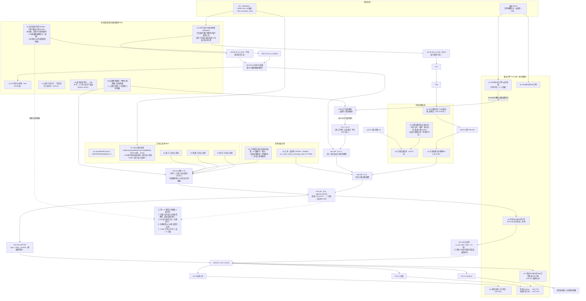

# 旧 Colab 成本链 — 数据流关系图

> **维护约定：本档案随改动同步更新。** 键、写回目标、冲突点变化时更新。
> 配套：[Colab 逐段现状](colab-cost-pipeline-current-state.md) · [GS 清单](colab-gsheet-inventory.md) · [EN 成本侧现状](en-cost-side-current-state.md)。

## 读图要点

1. **两条"EN→Colab"入口，同名不同物**：`cell 45` 的 `df_en_zlmb` **含** `en绍兴发货方式`（只服务头程）；`cell 99` 的 `df_en_zlmb` **不含**（服务成本）。
2. **桥接单点**：旧表 `皮壳成本平均202409-…` 提供 `品类尺寸面料编码 ↔ EN重量模板物料号`，是 `cell 103` 的合并键；也是 202606 那 139 行"无 EN 匹配"的成因。
3. **`二次加工成本` 的真实来源**：GS `二次加工成本2022` 的活跃列 —— 它本身是 `IMPORTRANGE` + `INDEX/MATCH` 指向 EN 的公式，**EN 无值时回落到手填旧列**（绍兴 188 / 美国 40 / 波兰 112 行）。
4. **`0.001` 注入点**：`cell 128`，条件依赖**旧字段** `成品`（应由 EN `绍兴发货方式` 判定）。
5. **列丢失点**：`cell 135` 白名单未收录 `EN绍兴包装半成品成本`/`EN绍兴包装成品成本` ⇒ 非 FBA 行在最终表为 NaN（仅因 FBA 帧是整份拷贝而重新出现）。
6. **写回目标共 7 处**：`写回2026年M月订单`(128)、`写回…FBA订单和非FBA订单`(151)、`检查运营人员-…`(162)、`写回Amazon…`(177)、`写回所有订单…`(179)、`合并多月非FBA通途订单`(186)、`FBA合并多月通途订单`(190 读)。
7. **"发货方式"4 处并存**（① 旧表字段 ② EN `绍兴发货方式` ③ 头程核算 ws 自有列 ④ Colab 订单字段=①）—— 是本链最根本的不一致源。
8. **每月跑两遍（顺序不可颠倒）**：第一遍 `4.3.1–4.6 → 4.6.1`（非 FBA，写 `写回{月}订单`）；第二遍 `4.7.1/4.7.2 → 再跑 4.3.1–4.6（⚠不跑 4.6.1） → 4.7.3/4.8`（FBA，写 `写回{月}FBA订单` 后合并）。图上的 `C128 → O_MID` 因此**发生两次**，且 `C99–C128` 复用同一个全局 `df_order_cost`。详见 [Colab 档案 §1.1](colab-cost-pipeline-current-state.md)。
