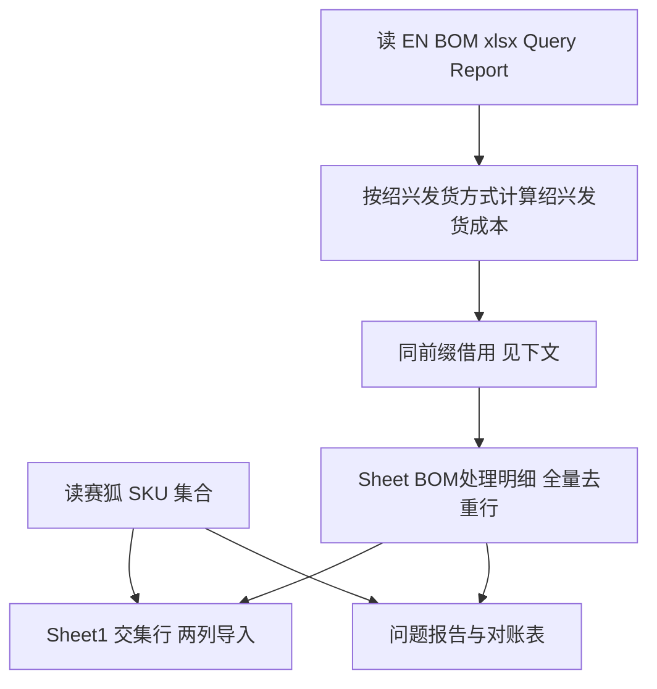

# EN BOM 成本 → 赛狐采购成本导入（item_cost_sx）

本文档描述 `item_cost_sx` 目录下 **采购成本导入** 流水线的背景、数据、用法与实现要点，供人类用户与其它 Agent 快速上手并保持信息一致。

---

## 文档维护约定（重要）

| 约定 | 说明 |
|------|------|
| **代码与文档同步** | 修改 [bom_cost_to_saihu_item_cost.py](bom_cost_to_saihu_item_cost.py) 的行为、默认路径、列名或输出结构时，**须同步更新本 README** 的对应章节。 |
| **变更记录** | 在文末 [变更记录](#变更记录) 中追加一行：日期、摘要、可选 PR/提交说明。 |
| **以代码为准** | 若 README 与代码不一致，以仓库内 Python 实现为准；发现冲突时应先改代码或先改文档，再消除差异。 |

---

## 背景与目标

- **业务**：ERPNext（EN）侧有定制报表「产品 BOM 成本列表」，赛狐侧需批量维护商品的 **采购成本（人民币）**。
- **问题**：两边 SKU 集合可能不一致；赛狐导入模板对「采购成本」不接受无意义的 **0**（与空一样需避免误导入）；部分行在 EN 中未维护完整 BOM，导致按规则算出的 **绍兴发货成本** 为 **空** 或 **0**，但同「品类-面料-尺寸」下其它颜色已有合理成本，可 **借用**。
- **目标**：从 EN 导出 xlsx 自动计算 **绍兴发货成本**，与赛狐商品导出求交后生成 **仅含可导入 SKU** 的两列表，并输出明细与对账报告。

---

## 数据来源与目录约定

以下路径均相对于工作区根目录（例如 `D:\Work\赛狐\Cursor`），与脚本内 `_ROOT` 一致。

| 角色 | 默认位置 | 说明 |
|------|----------|------|
| **EN BOM 源** | [en_bom_cost_list/](../en_bom_cost_list/) | 放置 ERP 导出的「产品BOM成本列表」`*.xlsx`。目录内若有多个文件，取 **修改时间最新** 的一份；自动忽略 `~$*.xlsx` 锁文件。 |
| **赛狐商品清单** | [edit_item/商品导出 x2215 Commodities2026_04_23(1).xlsx](../edit_item/商品导出%20x2215%20Commodities2026_04_23(1).xlsx) | 读工作表 **`商品`** 列 **`SKU`**，作为 Sheet1 的 **白名单**（仅输出赛狐已存在的 SKU）。可通过 `--saihu-commodities` 覆盖。 |
| **生成结果** | [item_cost_sx/out/](out/) | 默认输出目录（`--out-dir`）；产物为带时间戳的 xlsx，通常不提交 Git（根 `.gitignore` 忽略 `*.xlsx`）。 |

---

## 依赖环境

- Python 3.10+（建议）
- `pandas`、`openpyxl`

```bash
pip install pandas openpyxl
```

---

## 使用方法

在 `item_cost_sx` 目录下执行：

```bash
cd item_cost_sx
python bom_cost_to_saihu_item_cost.py
```

### 命令行参数

| 参数 | 默认值 | 含义 |
|------|--------|------|
| `--bom-dir` | `../en_bom_cost_list` | EN BOM 所在目录 |
| `--out-dir` | `out`（即 `item_cost_sx/out`） | 输出目录 |
| `--saihu-commodities` | `../edit_item/商品导出 x2215 Commodities2026_04_23(1).xlsx` | 赛狐商品导出路径 |
| `--skip-saihu-match` | 关闭 | 若指定：**不**按赛狐 SKU 过滤，Sheet1 含全部 BOM 行（慎用） |
| `--source` | 无 | 指定单一 BOM 文件；不指定则在 `bom-dir` 中取最新 xlsx |

### 主结果文件（示例名）

- `赛狐_采购成本导入_YYYYMMDD_HHMMSS.xlsx`
- `BOM成本处理_问题报告_YYYYMMDD_HHMMSS.xlsx`

---

## 处理流程概览



---

## 业务规则（实现要点）

### 1. 绍兴发货成本（初算）

依据列 **`绍兴发货方式`**（及 `皮壳成本`、`绍兴包装半成品成本`、`绍兴总成本` 等）：

| 发货方式 | 绍兴发货成本 |
|----------|----------------|
| 皮壳 | `皮壳成本`（缺则空） |
| 半成品 | `皮壳成本` + `绍兴包装半成品成本`（任一部分缺失则空） |
| 成品 | `绍兴总成本`（缺则空） |
| 其它或空 | 无法计算 |

**去重**：同一 `产品编号` 多行时 **保留末行**。

### 2. 同前缀成本借用（在赛狐过滤与写 Sheet1 之前作用于明细）

- 将 `产品编号` 按 `-` 分段：
  - **≥4 段**（如 `KS0001-QDKTR-140-RUSTYORANGE`）：取 **前 3 段** 为键（`KS0001-QDKTR-140`），表示 **品类-面料-尺寸**；最后一段为颜色，成本上允许与兄弟 SKU 互借。
  - **恰好 3 段**：整串为键。
  - **少于 3 段**：不借用。
- **出借方**：同键下，按表顺序 **第一次出现** 的 **非 0、非空** 绍兴发货成本（**仅用 BOM 初算结果**，不含借用后的值）。
- **借入方**：初算为 **空（None/NaN）** 或 **0** 的行；用上述出借方成本填充，并在明细列 **`成本借用自(产品编号)`** 写入对方 SKU。
- **一轮**：不迭代「借来的行」作为新的出借方。

> 说明：品名中若误用 `-` 导致分段与真实「品类-面料-尺寸」不一致，本规则会偏差；需从数据源规范 SKU。

### 3. 赛狐 Sheet1（可导入子集）

- 仅保留 `产品编号` ∈ 赛狐导出 **`SKU`** 集合的行。
- 列：`*SKU`、`采购成本(CNY)`，其中 `采购成本(CNY)` 来自（借用后的）`绍兴发货成本` 经 **赛狐导出规则** 处理：  
  **缺数、NaN、0 均不写有效数字**（单元格留空，避免赛狐把 0 当有效成本）。  
  写盘后对 `采购成本(CNY)` 列用 openpyxl 将 NaN/0 再清一次。

### 4. 明细表 `BOM处理明细`

- 为 **BOM 去重后的全行**，列包含：`赛狐存在`（是/否）、`绍兴发货成本`、`成本借用自(产品编号)`、`问题说明` 等。

### 5. 问题与对账文件

- `问题汇总`：含去重、初算问题、**同前缀借用** 说明等。
- `对账_仅EN有`：BOM 有、赛狐导出 SKU 中无的 `产品编号`。
- `对账_仅赛狐有`：赛狐有、BOM 中无的 `SKU`。
- 附加列 `ERP_BOM`、`赛狐源` 方便追溯文件名。

---

## 实现文件

| 文件 | 作用 |
|------|------|
| [bom_cost_to_saihu_item_cost.py](bom_cost_to_saihu_item_cost.py) | 唯一主脚本；逻辑见上 |

---

## 与仓库内其它模块的关系

- 与 [category/build_saihu_category_import.py](../category/build_saihu_category_import.py)（**商品分类** 导入）**独立**，无代码依赖；仅可能共用「赛狐商品导出」作为数据源习惯。
- 与 [multi_attr_saihu/](../multi_attr_saihu/) 多属性 **ERP→赛狐 商品** 流水线**独立**。

---

## 变更记录

| 日期 | 摘要 |
|------|------|
| 2026-04-27 | 首版：撰写 README；对应 `bom_cost_to_saihu_item_cost.py` 含初算、同前缀借用（含初算 0 借）、赛狐交集、采购成本 0/空 处理、默认 `out/` 等。随后 Git 提交。 |

*（之后每次功能或行为变更，请在此表追加一行。）*

---

## 故障与排查

- **Permission denied 写 xlsx**：关闭在 Excel 中打开的目标文件后重试。
- **赛狐源文件找不到**：检查 `--saihu-commodities` 与 `工作表=商品`、`列=SKU`。
- **Sheet1 行数远小于 BOM 行数**：属正常，多为赛狐未建档 SKU 被排除；见 `对账_仅EN有`。
- **借用为 0**：先确认同键下是否存在 **非 0 初算** 行；若全为 0 或键无法解析，则不会借用。
